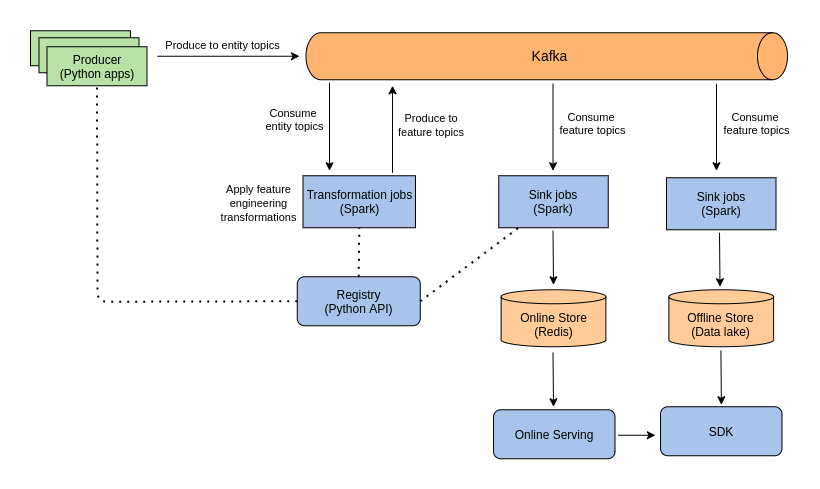

# Real-Time Feature Store

A production-style streaming feature store built to understand how ML features 
are computed, versioned, and served in real time. This project helped me learn 
how data flows from application events to a low-latency online store that ML 
models can query at inference time.



## What I Built

Most ML tutorials use static CSVs. Real production systems need features computed
from live event streams — this project replicates that pattern end to end.

I implemented the full pipeline:
- **Kafka** ingests raw application events (orders) from producers
- **Spark Streaming** transforms raw entities into ML-ready features
- **Schema Registry** enforces data contracts between producers and consumers
- **Redis** stores computed features as an online store for sub-millisecond lookup

## Pipeline Components

| Component | Role |
|---|---|
| `producer/` | Publishes order entities to Kafka topics |
| `registry/` | Schema definitions shared across pipeline stages |
| `transformations/` | Spark Streaming jobs — raw events to features |
| `sinks/` | Consumes feature topics, writes to Redis online store |

## Key Learnings

- Schema drift breaks pipelines silently — a schema registry prevents this
- Spark Streaming checkpointing is critical for exactly-once guarantees
- Redis sorted sets work well for time-windowed feature aggregations
- Separating online store (Redis) from offline store is the core Feature Store pattern

## Tech Stack

- Apache Kafka + Zookeeper
- Apache Spark Streaming
- Redis (online store)
- Docker + Docker Compose
- Kafdrop (Kafka UI)

## Requirements

- Docker >= 1.13.0
- Docker Compose >= 3
- `make`

## Getting Started

```bash
# Start all services (Zookeeper, Kafka, Kafdrop, Redis, Spark jobs)
make start

# Follow logs
make logs

# Run order producers once services are healthy
make produce-orders
```

Monitor running services:
- Kafdrop UI: http://localhost:9000
- Spark Transformations UI: http://localhost:4040/StreamingQuery
- Spark Sinks UI: http://localhost:4050/StreamingQuery

## What I Would Add Next

- Feast or Hopsworks integration for a proper feature registry
- Point-in-time correct joins for training data generation
- Offline store (Parquet on S3) alongside the Redis online store
- Feature monitoring for drift detection at the store level
